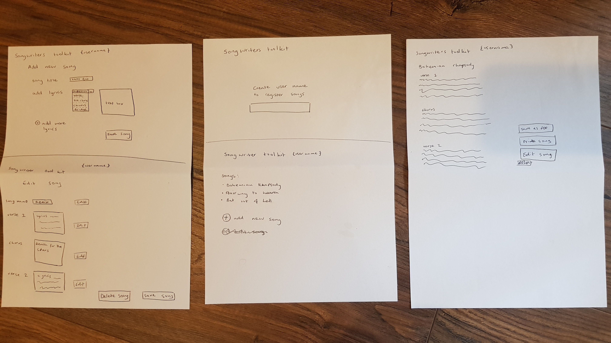

# Songbook

The objective of this project is to create a website that is connected to a database in which people can upload the lyrics and information of their favourite songs.

 
## UX
 
I want this website to be effortless to navigate through with minimal distractions or unnesary text. I want it to look simple and flow through each page offering everything the user needs rather than bombarding them with information. This website is for music lovers of all ages and so i need to make the colour palettes and overall design as neutral and nonintrusive as possible. The user wants to be able to access the songs in order to find out further details aswell as being able to upload their own if they so wish. Our site will achieve this by displaying all songs uploaded and offering a clear '+' to add their own. The '+' symbol is universally known for addition which offers clarity aswell as a slick pleasing visual without the need to be aided by text.

- If i am the user, I want to add information about a song, so that i can easily access that information in a visual please format in the future knwoing that it is safetly storesd in a database.

## Features

The '+' feature allows us to add new songs.
The 'delete button' allows us to delete existing songs.
The 'edit button' allows us to edit existing songs.

When the user first lands on our page they will be presented by a list of all the songs in our database. They will then be given the oportunity to either add a new song to the database or click on an existing song to read more information about that particular tune. If the user decides to click on an existing song they will be taken to a page with information unique to that particular song displaying: Song-name, song-writer, artists-name, wether its an original song or a cover, wether the lyrics are clean or explicit aswell as being able to read all of the lyrics to that song. From here they can either click on the 'songbook' logo to be taken back to the home page where all of the songs are displayed or they are presented with the options to either edit or delete the song that they are currently viewing. If they decide to edit the song the will be taken to an edit page where they can make amendment to the song which upon submission will replace the current information stored on the database. If they delete the song it will be erased from the database. At the home page if the user decides that they want to add a new song they will be taken to an 'add song' section where they can fill in all the details of that particular song which will then be upload to the database before being displayed on the homepage within the list of the existing songs. There is also a neat tab to instantly show the user how many songs there are in total in the database.

### Features Left to Implement
With more time and resources i would like to add a page that enables people to enter a username so that only the people who have uploaded the song have the ability to delete it.
I would also like to reformate the lyrics section to give it a clear structure by seperating the different song element making it looks tidier and more visually striking. 
I would also like the include some sort of interaction between users such as a text box or 'like' section to show appreciation towards the people uploading the songs to give insentive to the user to keep coming back.

## Technologies Used

This website uses:
- HTML to structure the webpage
- CSS to style the webpage
- Javascript the make the website reactive to the user (https://www.javascript.com/)
- Python to build the site. (https://www.python.org/)
- mongoDB to store the information on a database (https://www.mongodb.com/)
- flask as a microframwework supported by python. (http://flask.pocoo.org/)
- json to transport and store data (https://www.json.org/)
- heroku to deploy the site (https://www.heroku.com/)
- [JQuery](https://jquery.com)
    - The project uses **JQuery** to simplify DOM manipulation.
- I used materialize to help style my page and make it visually familiar (https://materializecss.com/)

## Testing
I have tested this website on multiple devices to insure that in runs smoothly across differently sized devices. I got a few people to trial the site to ensure that it was user friendly without complications.

Originally i wanted to design the lyrics section of the website so that you could add verses and choruses and the various other sections of the song in order to present it to the end user in the most pleasing way however because every song is a different length and includes different sections it was beyond my current capabilities to execute. If the intial launch of this site is successful i can look at emplementing this in the future.

## Deployment

git add .
git commit -m ""
git push to heroku

http://songbook-eddiebrett.c9users.io:8080/

## Credits

### Content
- The information for the current lyrics were found at ("https://www.lyricsfreak.com/b/blink+182/all+the+small+things_20019928.html"), ("https://www.google.com/search?q=adele+make+you+feel+lyrics&rlz=1C5CHFA_enGB798GB798&oq=adele+make+you+&aqs=chrome.4.69i59j0j69i57j0l3.7240j0j4&sourceid=chrome&ie=UTF-8")
### Media
- For copyright reasons and because i didn't feel any benifit to the website through doing so i have not included any external media.

### Acknowledgements
I got inspirations for colour from: https://visme.co/blog/website-color-schemes/
And i got inspiration for different features from materialize.
